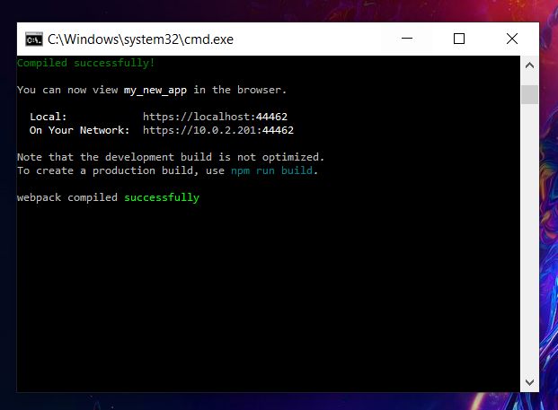

# react-demo
## A demo to build technical skills in React.js, C#, ASP.net, and SQl. 

### Front-end UI
React.js

### Service level 
ASP.net 6 
C#

### Database
SQL? MongoDb?

## Project Spin Up for https://localhost:44462/
cd ~react-demo\my-new-app
dotnet run my-new-app
go to https://localhost:7223 and wait for host to load and redirect

## Troubleshooting 

## Planning for future improvments

Hosting Site: [Hosting and Deploying on Vercel](https://www.atatus.com/blog/host-react-app-for-free/#:~:text=4.-,Vercel,the%20popular%20development%20platform%20Next.)

Adding database: [MongoDb with TypeORM](https://www.tutorialspoint.com/typeorm/typeorm_working_with_mongodb.htm)

Migration from React.js to typescript: [Javascript to Typescript](https://marketsplash.com/tutorials/typescript/how-to-convert-react-js-to-typescript/#:~:text=js%20project%20to%20TypeScript%20can%20help%20catch%20errors%20earlier%20and,and%20using%20TypeScript%20with%20JSX)

Add Github Actions: [Github Actions](https://dev.to/dyarleniber/setting-up-a-ci-cd-workflow-on-github-actions-for-a-react-app-with-github-pages-and-codecov-4hnp)

Add AWS Codepipeline: [AWS Codepipeline](https://aws.amazon.com/codepipeline/)

Add Auth0: [Auth0 Experiment](https://auth0.com/blog/complete-guide-to-react-user-authentication/)

